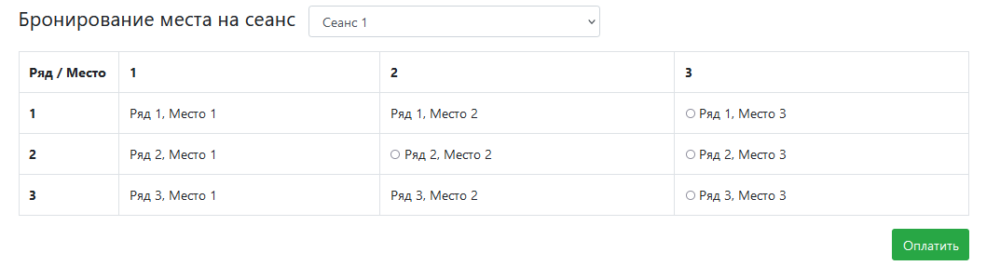
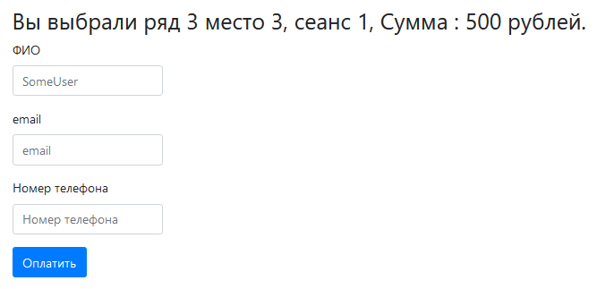
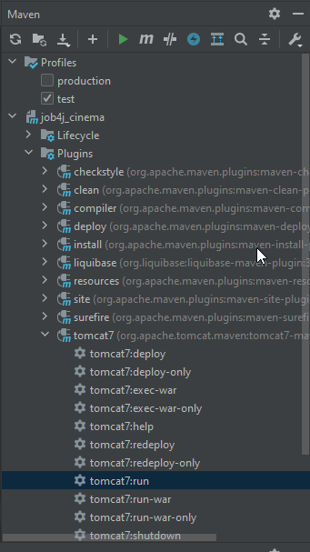

 Проект "Кинотеатр"

Данные на index.html загружаются через Ajax.
Для этого создан сервлет HallServlet.

Если место занято, то нужно это отображать в таблице.

Страница обновляется периодически через timout.

После того как пользователь выбрал место, выполняется переход на страницу payment.html. Сделано это через JS - window.local.href.

На странице указаны место и сумма денег.

Впроекте есть три слоя: Controller, Service, Persistence.

Важно. Клиенты могут забронировать одинаковые места. Чтобы этого избажать, добавлены ограничения.

Ограничения добавленны на три колонки session_id, row, cell (сеанс, ряд и место).

В JDBC нужно добавлена обработка ConstrainsViolationException.

Проект требует доработки: нужно добавить проверку, что пользователь ввел номер телефона именно цифрами. 

Проект запускается серез tomcat7:run

